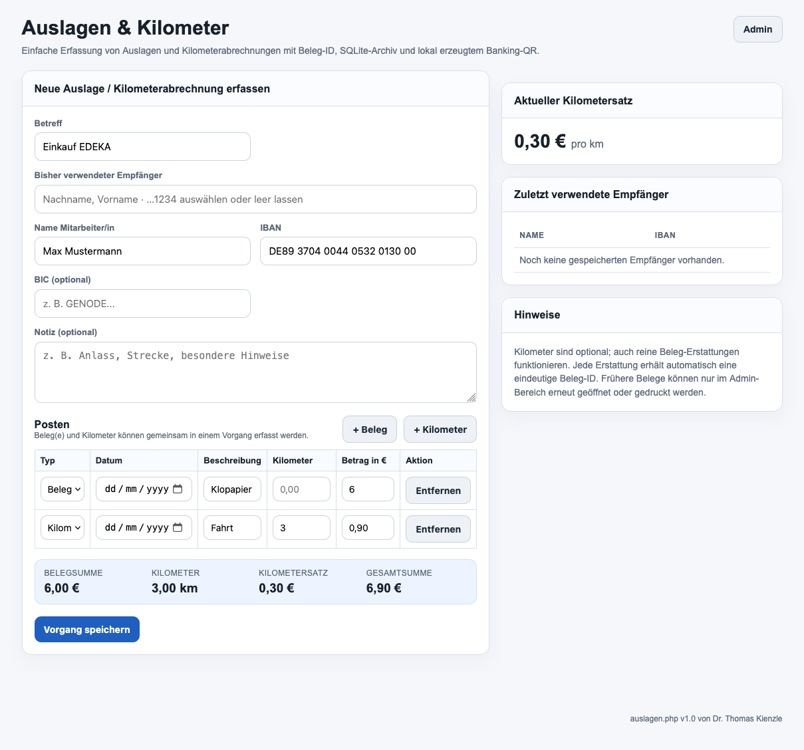
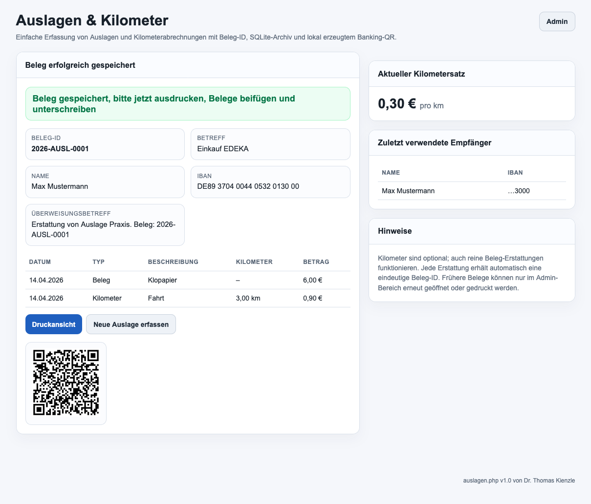
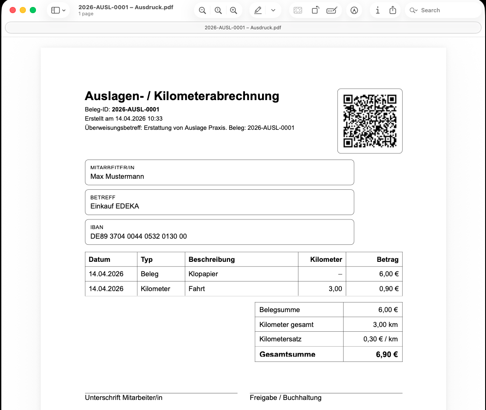

# auslagen.php v1.0

Kompakte lokale PHP-Anwendung zur Erfassung und zum Ausdruck von Auslagen- und Kilometerabrechnungen für Mitarbeitende einer Praxis.



## Funktionen

- Erfassung von **Belegen** und **Kilometerposten** in einem gemeinsamen Vorgang
- Automatische Vergabe einer eindeutigen Beleg-ID, z. B. `2026-AUSL-0005`
- Automatischer Überweisungsbetreff, z. B. `Erstattung von Auslage Praxis. Beleg: 2026-AUSL-0005`
- Speicherung aller Vorgänge in **SQLite** (`auslagen.sqlite`)
- Wiederdruck alter Belege **nur im Admin-Bereich**
- Vorschlagsliste für bereits verwendete Empfänger mit Name und IBAN-Endstellen
- Einstellbarer **Kilometersatz** im Admin-Menü
- Admin-Funktionen für:
  - Passwort ändern
  - Kilometersatz ändern
  - Startzähler setzen
  - alte Vorgänge löschen
  - Datenbank leeren
- Lokaler **EPC-/GiroCode-QR** für Banking-Apps
- Druckansicht mit Unterschriftsfeldern
- Formularinhalte bleiben bei Eingabefehlern erhalten


## Design / Aufbau

- **Eine einzige PHP-Datei**: `auslagen.php`
- **Separate SQLite-Datei** im selben Verzeichnis: `auslagen.sqlite`
- Oberfläche für den Praxisalltag bewusst schlicht, lokal und druckorientiert
- Keine externe QR-Code-Nutzung, keine Cloud-Abhängigkeit
- Drucklayout für möglichst platzsparende Ausgabe auf **A4**
- Footer: `auslagen.php v1.0 von Dr. Thomas Kienzle`







## Voraussetzungen

- Ubuntu 24.04 LTS, Debian, Raspberry oder ähnlich, läuft auf jeden Linux
- Apache2
- PHP mit SQLite-Unterstützung
- lokal installierter QR-Generator `qrencode`

## Installation unter Ubuntu 24.04 LTS

Der folgende Pasteblock installiert alles Nötige lokal, aktiviert Apache **nicht dauerhaft beim Boot**, startet ihn aber **einmal für die aktuelle Sitzung**, bindet ihn nur an `127.0.0.1` und kopiert `auslagen.php` ins Webroot.

**Lokaler Test:**
```bash
sudo apt update && \
sudo apt install -y apache2 php libapache2-mod-php php-sqlite3 sqlite3 qrencode && \
sudo systemctl disable apache2 && \
sudo sed -i 's/^Listen 80$/Listen 127.0.0.1:80/' /etc/apache2/ports.conf && \
sudo perl -0pi -e 's#<VirtualHost \*:80>#<VirtualHost 127.0.0.1:80>#g' /etc/apache2/sites-available/000-default.conf && \
sudo mkdir -p /var/www/html && \
sudo install -m 664 -o www-data -g www-data ./auslagen.php /var/www/html/auslagen.php && \
sudo apache2ctl configtest && \
sudo systemctl restart apache2 && \
echo && echo "Fertig. Aufruf: http://127.0.0.1/auslagen.php" && \
echo "Apache startet beim nächsten Boot NICHT automatisch."
```

**Wichtige Dependency:**
```bash
sudo apt update && \
sudo apt install -y apache2 php libapache2-mod-php php-sqlite3 sqlite3 qrencode && \
# wenn das verzeichnis so stimmt einkommentieren:
#sudo install -m 664 -o www-data -g www-data ./auslagen.php /var/www/html/auslagen.php && \
sudo apache2ctl configtest && \
sudo systemctl restart apache2 && \
echo && echo "Fertig. Aufruf: z.B. http://##server##/auslagen.php" && \
```


## Bedienung

1. `http://127.0.0.1/auslagen.php` öffnen
2. Betreff, Name und IBAN eintragen
3. Beleg- und/oder Kilometerposten hinzufügen
4. Vorgang speichern
5. Ausdruck erstellen, Belege beifügen und unterschreiben

## Admin-Zugang

- Standardpasswort beim ersten Start: `admin`
- Danach im Admin-Menü bitte direkt ändern

## Hinweise

- Der QR-Code wird nur erzeugt, wenn lokal `qrencode` verfügbar ist
- Alte Belege sind für normale Nutzer nicht direkt abrufbar
- Schreibrechte im Webverzeichnis müssen so gesetzt sein, dass `auslagen.sqlite` angelegt und beschrieben werden kann

---

**Datei:** `auslagen.php`  
**Version:** `1.0`  
**Footer:** `auslagen.php v1.0 von Dr. Thomas Kienzle`
